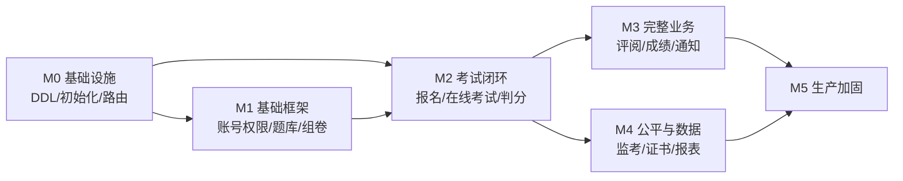

# exam-flow 开发任务清单(Backlog)

| 项目 | 内容 |
|---|---|
| 版本 | v0.1 |
| 更新日期 | 2026-08-02 |
| 当前状态 | 代码骨架已完成(13 个后端模块可编译、3 个前端工程可构建、deploy 就绪),进入功能实现阶段 |
| 对应文档 | [PRD.md](./PRD.md)(功能需求)、[TDD.md](./TDD.md)(技术设计)、[DESIGN.md](./DESIGN.md)(UI 规范) |

## 使用说明

- **编号规则**:`<里程碑>-<序号>`(如 `M1-003`);横切任务用 `X-<序号>`。
- **优先级**:P0 = 该里程碑的验收必需;P1 = 可延后,不阻塞里程碑交付。
- **任务状态**:⬜ 待开发 · 🔄 进行中 · ✅ 已完成(实现时维护)。
- **验收标准**:每条任务实现后须满足其验收标准,与 PRD 需求编号对应,可追溯。
- 每个里程碑交付时,按 [DESIGN.md](./DESIGN.md) 一致性自查清单核对 UI,按 TDD §12 规范核对代码与文档。

---

## M0 基础设施与联调环境(当前阶段,先行完成)

| 编号 | 任务 | 涉及模块 | 验收标准 | 优先级 |
|---|---|---|---|---|
| M0-001 | 数据库 DDL 脚本:按 TDD §4.2 生成全部核心表(含索引/分片键预留) | 全部服务 | `backend/docs/schema.sql` 可在 MySQL 8 完整执行;表结构与 TDD §4.2 一致 | P0 |
| M0-002 | 初始化数据脚本:管理员账号、角色、组织、字典、全局参数 | exam-user / exam-sys | 启动即可登录管理员账号 | P0 |
| M0-003 | 本地一键启动脚本:`docker compose up` 后自动执行 DDL/初始化并引导服务启动顺序 | deploy | `scripts/dev-up.sh` 一条命令拉起基础设施 + 核心服务 | P1 |
| M0-004 | 网关全量路由:补齐 10 个服务路由(现仅 auth/exam 示例) | exam-gateway | 各服务接口经网关可达,白名单路径放行 | P0 |
| M0-005 | 统一响应与错误码联调:全服务异常处理生效,错误码与 TDD 附录 B 一致 | exam-common + 全部 | 单测覆盖 BusinessException 转换 | P0 |
| M0-006 | CI 流水线:push 触发后端编译 + 前端构建 + 产物归档 | CI(GitLab/Jenkins) | 一次 push 即可获得构建结果 | P1 |
| M0-007 | API 文档聚合:各服务 springdoc 经网关统一访问 | 全部服务 | `/swagger-ui.html` 各服务可访问 | P1 |

## M1 基础框架:账号权限、题库、组卷

| 编号 | 任务 | 对应需求 | 涉及服务 | 验收标准 | 优先级 |
|---|---|---|---|---|---|
| M1-001 | 用户/组织 CRUD + 多级组织树 | FR-ORG-01/03 | exam-user | 组织树增删改查,用户挂组织,列表分页 | P0 |
| M1-002 | RBAC:角色、菜单权限、数据权限(组织范围 SQL 层拦截) | FR-ORG-02 | exam-user | 不同角色菜单不同;数据权限按"全部/本级/下级"隔离 | P0 |
| M1-003 | 登录认证:JWT 双令牌(access 30min / refresh 7d,可撤销) | FR-AUTH-02/04 | exam-auth + gateway | 登录签发双令牌;刷新续期;强制下线生效 | P0 |
| M1-004 | 短信验证码登录 + 频控(1 分钟间隔/10 次每日上限) | FR-AUTH-01/03 | exam-auth + exam-message | 验证码生命周期与频控规则达标(短信可先用日志模拟) | P0 |
| M1-005 | 口令安全:bcrypt、复杂度校验、5 次失败锁定 30 分钟 | FR-AUTH-02 | exam-auth | 安全策略参数化(走 sys 参数) | P0 |
| M1-006 | 题库 CRUD + 题型结构校验(7 类题型) | FR-QB-01/02/03 | exam-question | 富文本/图片/公式(LaTeX)存储;选择题必含选项与答案校验 | P0 |
| M1-007 | 审题流程状态机(出题 ≠ 审题人,发布后修改重新送审) | FR-QB-04 | exam-question | 状态流转与越权操作被拒,留痕 | P0 |
| M1-008 | 题目批量导入导出(Excel 模板,逐行错误报告) | FR-QB-05/08 | exam-question | 导入 1,000 题错误行定位准确;题号唯一 | P1 |
| M1-009 | 固定组卷(逐题挑选) | FR-PAPER-01 | exam-paper | 卷面结构与分值核算正确 | P0 |
| M1-010 | 策略组卷蓝图(题型/题量/知识点/难度配比 + A/B 卷) | FR-PAPER-02 | exam-paper | 蓝图校验;自动抽题分布符合配比 | P0 |
| M1-011 | 试卷状态机 + 不可变快照(发布即固化,含题目内容快照) | FR-PAPER-06、TDD §4.2.2 | exam-paper | 发布后改题不影响已发布卷;快照可完整还原 | P0 |
| M1-012 | 试卷预览(含答案模式)与审批发布 | FR-PAPER-05 | exam-paper | 仅组卷人/审批人可预览;审批通过方可发布 | P0 |
| M1-013 | 题库/试卷管理后台页面(admin 前端,遵循 DESIGN.md) | — | frontend/admin | 页面与接口打通;自查清单通过 | P0 |

## M2 考试闭环:计划、报名、在线考试、客观题判分

| 编号 | 任务 | 对应需求 | 涉及服务 | 验收标准 | 优先级 |
|---|---|---|---|---|---|
| M2-001 | 考试计划创建/编辑与审批流 | FR-REG-01 | exam-registration | 计划审批通过后才可报名;状态机完整 | P0 |
| M2-002 | 报名条件规则 + 自动预审(组织范围/前置资格) | FR-REG-02/03 | exam-registration | 规则引擎判定正确,预审结论留痕 | P0 |
| M2-003 | 人工审核 + 批量审核 + 报名名单导出 | FR-REG-04 | exam-registration | 批量审核 1,000 条 < 5s;导出加密 | P0 |
| M2-004 | 名额控制(满即止/候补)+ 准考证号生成 | FR-REG-05/06 | exam-registration | 并发抢报不超卖(唯一索引兜底) | P0 |
| M2-005 | 场次管理 + 机位自动分配 + 排考表导入导出 | FR-SCHED-01/02 | exam-registration | 排考结果可导出,机位不冲突 | P0 |
| M2-006 | 排考冲突检测(同考生同时段唯一,跨考次) | FR-SCHED-05 | exam-registration | 冲突数据被拒绝并提示 | P0 |
| M2-007 | 考试会话创建与抽卷:`seed = SHA256(snapshot+slot+candidate)`,审计可重放 | FR-EXAM-01/02、TDD §6.3 | exam-service | 同种子结果确定;不同考生分布均衡;重放验证一致 | P0 |
| M2-008 | 作答保存链路:seq 对齐 + RocketMQ 事务消息 + 批量写 worker | FR-EXAM-05、TDD §3.2/§6.1 | exam-service | 断点重发正确;单测覆盖乱序/重发;批量写 ≤ 200 行/事务 | P0 |
| M2-009 | 心跳与 Redis 在线状态(TTL 60s) | FR-EXAM-07 | exam-service | 离线判定准确,监考视图可用 | P0 |
| M2-010 | 交卷链路:setnx 幂等锁 + 唯一索引 + 事务消息,失败指数退避重试 | FR-EXAM-06、TDD §3.3 | exam-service | 重复提交幂等;交卷必达(模拟故障不丢) | P0 |
| M2-011 | 断线恢复(resume):剩余时间服务端计算,进入次数上限 | FR-EXAM-07/08、TDD §3.4 | exam-service | 重进恢复已存答案,时间不可伪造 | P0 |
| M2-012 | 客观题自动判分(含多选漏选部分分等规则,幂等可重放) | FR-GRADE-01 | exam-grading | 判分只依赖快照;重放结果一致 | P0 |
| M2-013 | 成绩核算与预发布(总分自动核算,发布前隐藏) | FR-GRADE-07/08 | exam-grading | 分项/加权/倒扣规则配置生效 | P0 |
| M2-014 | 考生端答题界面完整实现(答题卡/富文本/附件上传/草稿箱) | FR-EXAM-03/04/05 | frontend/exam-client | 七类题型可作答;断网 5 分钟不丢作答 | P0 |
| M2-015 | 考前须知 + 全屏锁定 + 禁复制/打印(基础防作弊) | FR-EXAM-02/09/10 | frontend/exam-client | 全屏锁定生效;离屏事件可上报 | P0 |
| M2-016 | 管理后台考试管理页(计划/审核/排考,admin 前端) | — | frontend/admin | 页面与接口打通 | P0 |

## M3 完整业务:评阅、成绩发布、通知

| 编号 | 任务 | 对应需求 | 涉及服务 | 验收标准 | 优先级 |
|---|---|---|---|---|---|
| M3-001 | 评阅任务分派(随机/指定)+ 答卷脱敏(隐藏姓名/单位/准考证) | FR-GRADE-02 | exam-grading | 阅卷员界面无任何可识别信息 | P0 |
| M3-002 | 双评/仲裁:分差阈值取均值,超限三评仲裁 | FR-GRADE-03 | exam-grading | 仲裁流程正确;分差规则参数化 | P0 |
| M3-003 | 评分细则(采分点/示例答案)与评阅界面、进度看板 | FR-GRADE-04/05 | exam-grading + admin | 组长可看进度/工作量;中途换人 | P0 |
| M3-004 | 成绩发布/公示期(默认 3 个工作日)/申诉 | FR-SCORE-01/02/03 | exam-grading | 公示期状态与申诉标记正确 | P0 |
| M3-005 | 成绩更正流程(申请 → 复核 → 审批 → 发布,全程留痕) | FR-SCORE-07 | exam-grading | 更正记录 before/after 可审计 | P0 |
| M3-006 | 成绩单与批量导出(加密 Excel,导出留痕) | FR-SCORE-04 | exam-grading | 导出权限受控,文件加密 | P1 |
| M3-007 | 消息服务:模板渲染/站内信/短信/失败重试 3 次/站内信兜底 | FR-MSG-01/02/04 | exam-message | 发送失败自动重试;记录回执 | P0 |
| M3-008 | 通知节点触达:报名成功/驳回/考前 T-1 天/开考提醒/成绩公布 | FR-MSG-03 | exam-message + XXL-JOB | 节点触发准确,批量 ≤ 10 万条/小时 | P0 |
| M3-009 | 通知记录查询与回执展示 | FR-MSG-04 | exam-message | 记录可检索 | P1 |
| M3-010 | 管理后台:阅卷管理/成绩管理页面 | — | frontend/admin | 双评流程可在页面操作 | P0 |

## M4 公平与数据:监考防作弊、证书、报表

| 编号 | 任务 | 对应需求 | 涉及服务 | 验收标准 | 优先级 |
|---|---|---|---|---|---|
| M4-001 | 行为日志采集(切屏/离屏/粘贴/失焦/IP 变化)与批量异步写入 | FR-PROCTOR-01 | exam-service → exam-proctor | 日志含时间戳/次数/元数据,分片表 | P0 |
| M4-002 | 风险引擎:切屏 ≥3 次标记疑似,≥6 次可配置强制交卷 | FR-PROCTOR-02 | exam-proctor | 阈值走 sys 参数;触发即告警 | P0 |
| M4-003 | 监考台实时视图(在线/离线/风险置顶) | FR-PROCTOR-05 | exam-proctor + admin | 场次内考生状态 ≤ 5s 延迟刷新 | P0 |
| M4-004 | 异常处置:警告弹窗/强制交卷/作废(二次验证,留痕) | FR-PROCTOR-06 | exam-proctor | 处置操作全程可审计 | P0 |
| M4-005 | 作弊申诉复核闭环(≤ 3 个工作日) | FR-PROCTOR-07 | exam-proctor | 撤销标记/维持原判流程完整 | P1 |
| M4-006 | 人脸核验(进入时)+ 定时抓拍比对(降级人工核验) | FR-PROCTOR-03/04 | exam-service + 第三方 | 第三方不可用时考试不中断 | P1 |
| M4-007 | 屏幕水印(考生 ID + 时间)+ 确定性选项乱序 | FR-PROCTOR-09 | exam-client + exam-paper | 乱序结果可复现;水印防截图追溯 | P1 |
| M4-008 | 电子证书生成(PDF + 防伪二维码 + 在线验证) | FR-SCORE-05 | exam-grading | 证书可验证真伪;防篡改 | P1 |
| M4-009 | 考次总览报表(报名/实考/缺考/通过率/分数分布) | FR-REPORT-01 | exam-report + admin | 数据权限隔离;数字准确 | P0 |
| M4-010 | 试题分析(通过率/区分度/知识点掌握度)+ 考试报告导出 | FR-REPORT-02/03 | exam-report | PDF/Word 报告含图表 | P1 |
| M4-011 | 监考台与管理后台页面 | — | frontend/admin | 页面与接口打通,自查清单通过 | P0 |

## M5 生产加固与上线

| 编号 | 任务 | 对应 TDD/PRD | 验收标准 | 优先级 |
|---|---|---|---|---|
| M5-001 | 10,000 并发压测与调优(保存 2,000 QPS/交卷 500 QPS 混合场景) | TDD §10、§7.1 | 保存 P95 ≤ 300ms、交卷 P95 ≤ 3s、零丢单;压测纳入 CI 门禁 | P0 |
| M5-002 | 等保三级安全加固 + 渗透测试(OWASP Top 10) | TDD §7.6 | 无高危漏洞;安全基线符合 | P0 |
| M5-003 | 审计日志生产落地(独立存储、只追加、留存 ≥ 5 年、before/after 对比) | TDD §7.5 | 审计完整性与防篡改验证通过 | P0 |
| M5-004 | 容灾演练(双可用区切换、数据库 MGR 主备切换) | TDD §9 | RPO ≤ 5min、RTO ≤ 30min 实测达标 | P0 |
| M5-005 | 考前巡检自动化补全(试卷完整性/场次配置/通道探测/资源预热) | TDD §8.3 | 巡检失败阻塞开考 | P1 |
| M5-006 | 监控告警完善(业务看板 + P0/P1 分级告警 + 考试期间值班) | TDD §8.1 | 告警 5 分钟内触达值班 | P0 |
| M5-007 | 备份与恢复演练(每日全量 + binlog 增量,季度演练报告) | TDD §9 | 恢复演练成功率 100% | P0 |
| M5-008 | 国产化适配专项(openGauss/达梦、麒麟、东方通) | TDD §2.3 | 适配验证报告通过 | P1 |
| M5-009 | 考试期间变更冻结纪律落地(流程 + 审批) | TDD §8.2 | 流程文档化并执行 | P1 |

## 横切任务(贯穿各里程碑)

| 编号 | 任务 | 说明 | 优先级 |
|---|---|---|---|
| X-001 | 网关用户上下文透传(X-User-Id 请求头)+ 服务间调用鉴权 | 登录实现后即接入,各服务从上下文取操作人 | P0 |
| X-002 | 考试接口防重放签名(timestamp + nonce + HMAC-SHA256) | TDD §5.3;交卷/保存/心跳必须 | P0 |
| X-003 | 审计切面接入 MQ 异步落库(替换占位日志) | 与 M5-003 衔接 | P0 |
| X-004 | 单元测试体系:核心模块(交卷/保存/判分/抽题)覆盖率 ≥ 80% | TDD §12;随功能实现同步补 | P0 |
| X-005 | E2E 自动化:三条主链路(完整考试/异常链路/管理链路) | PRD §9.1 | P1 |
| X-006 | 统一身份认证对接(SSO/OIDC/LDAP) | 待业务确认(Q1/Q2),确认后接入 | P1 |
| X-007 | 短信双供应商容灾 + 失败自动切换 | FR-MSG、TDD §11 | P1 |
| X-008 | 前端 DESIGN.md 一致性自查(每迭代 UI 交付时) | CLAUDE.md 硬性规则 | P0(持续) |

---

## 依赖关系与排期建议

- **M1 完成后**:可支撑「题库 + 组卷 + 账号」内部试运行。
- **M2 完成后**:可支撑一场**纯客观题**考试的端到端(PRD §10 里程碑 M2 交付标准)。
- **M3 完成后**:全流程可用(含主观题人工评阅),建议先内部考试试点。
- **M4 完成后**:防作弊与数据分析就绪,可正式对外。
- **M5 完成后**:等保测评通过,生产上线。

## 待业务确认项(阻塞性)

以下确认项影响任务范围,确认后更新本清单:

| # | 问题 | 影响任务 |
|---|---|---|
| Q1 | 网络形态:互联网考生 / 内网专网? | M5 安全、部署架构 |
| Q2 | 是否对接现有 SSO/LDAP? | X-006 |
| Q3 | 人脸核验是否首发必备?供应商选型? | M4-006 |
| Q4 | 是否存在涉密考试类别(需离线/断网作答)? | M2 考试链路 |
| Q5 | 证书是否需电子签章/与查验平台对接? | M4-008 |
