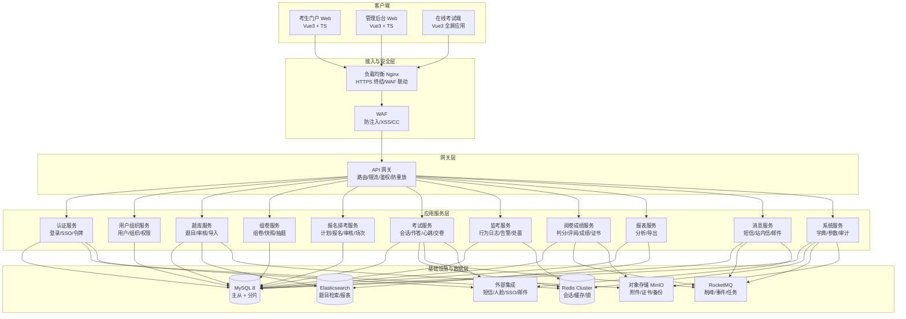
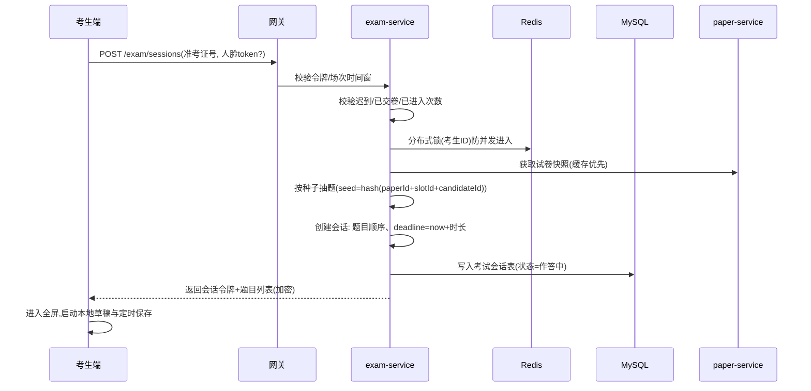
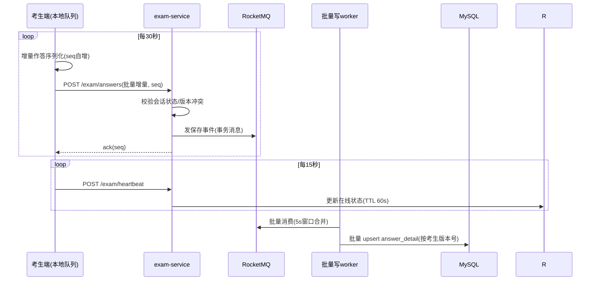
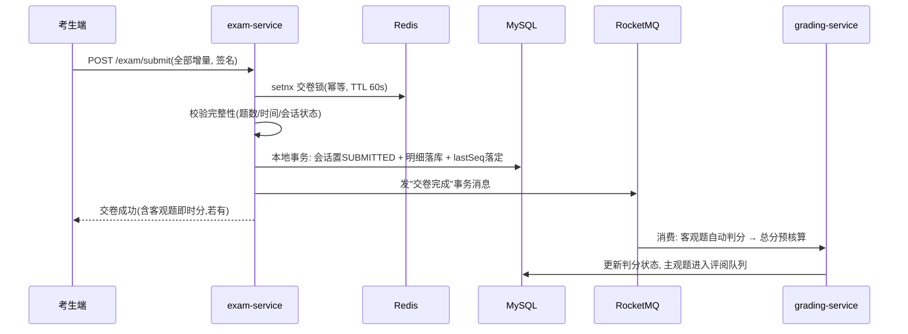
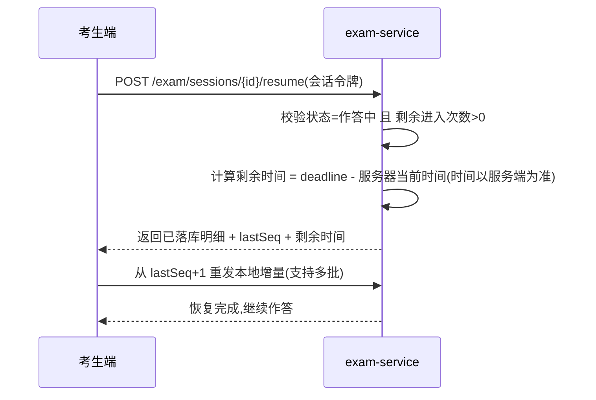
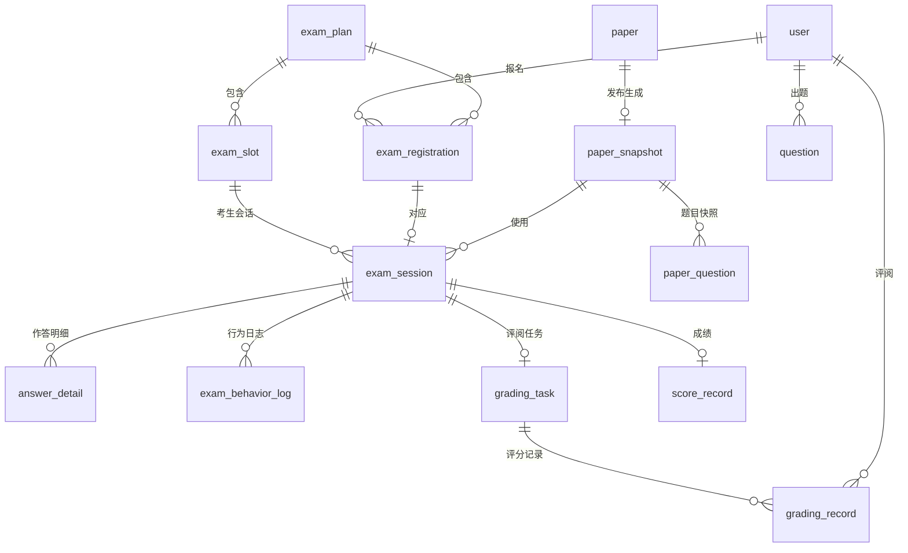

# 在线考试系统技术设计文档(TDD)

| 项目 | 内容 |
|---|---|
| 文档版本 | v0.1(初稿) |
| 编制日期 | 2026-08-02 |
| 对应文档 | [PRD.md](./PRD.md)(产品需求文档)、[DESIGN.md](./DESIGN.md)(视觉设计规范) |
| 适用范围 | exam-flow 在线考试系统全量开发、测试、部署与运维 |
| 状态 | 待评审 |

---

## 1. 设计目标与约束

### 1.1 设计目标

1. **可靠**:考试不可重来,交卷、作答保存绝不丢数据;考试时段可用性 ≥ 99.9%。
2. **可扩展**:支持单考次 5 万注册、1 万同时在线作答,保存/心跳 2,000 QPS、交卷峰值 500 QPS;容量可水平扩展。
3. **可审计**:试卷抽题可复现、操作全留痕、成绩变更走流程,满足等保 2.0 三级。
4. **安全**:加密存储敏感数据,纵深防御防作弊,接口防重放防抓包。
5. **可维护**:服务化拆分、统一规范、可观测性完备,支持灰度发布与一键回滚。

### 1.2 关键约束(来源:PRD §7)

| 约束 | 取值 |
|---|---|
| 并发容量 | 同时在线 10,000;登录 200 QPS;保存/心跳 2,000 QPS;交卷峰值 500 QPS |
| 响应时间 | 页面 P95 ≤ 500ms(考生端);保存 P95 ≤ 300ms;交卷 P95 ≤ 3s |
| 可用性 | 考试时段 ≥ 99.9%,RPO ≤ 5 分钟,RTO ≤ 30 分钟 |
| 安全 | 等保 2.0 三级,HTTPS TLS1.2+,AES-256 存储加密,审计日志不可篡改 |
| 数据留存 | 考试档案/审计日志 ≥ 5 年 |
| 兼容性 | 桌面 Chrome/Edge;管理后台需支持国产化桌面(P1) |

### 1.3 设计原则

- **服务化拆分,考试域独立**:考试/交卷链路是唯一的高并发核心,拆为独立服务,与其他域(题库、报名)故障隔离。
- **交卷链路优先保证**:一切设计向"作答不丢、交卷必达"让路。
- **状态机驱动**:答卷、试卷、报名等核心对象全部显式状态机,避免脏状态。
- **最终一致性为主**:跨服务操作尽量本地事务 + 消息异步化,不引入分布式事务。
- **复用不造轮子**:选型全部采用政企行业成熟组件,不引入小众框架。

---

## 2. 总体架构

### 2.1 逻辑架构



### 2.2 服务拆分与职责

| 服务 | 职责 | 关键数据 | 扩展性要点 |
|---|---|---|---|
| auth-service | 登录认证、SSO 对接、令牌签发、找回密码 | 账号凭证 | 无状态,水平扩展 |
| user-service | 用户、组织树、角色权限、账号生命周期 | 用户/组织/角色 | 缓存组织树 |
| question-service | 题库 CRUD、审题流、批量导入导出、题目检索 | 题目 | 题目缓存 + ES 检索 |
| paper-service | 固定/策略组卷、试卷快照、预览审批 | 试卷/快照 | 快照不可变,只读缓存 |
| registration-service | 考试计划、报名审核、场次/机位、准考证 | 报名/场次 | 批量审核异步化 |
| exam-service | 考试会话、抽卷、作答保存、心跳、交卷、断线恢复 | 答卷/作答明细 | **核心服务**,异步削峰 |
| proctor-service | 行为日志收集、风险判定、监考台、处置 | 行为日志/风险记录 | 日志批量异步写 |
| grading-service | 客观题自动判分、主观题分派/双评/仲裁、成绩/更正/证书 | 评阅/成绩 | 判分与核算异步化 |
| report-service | 考次总览、试题分析、报告导出 | 聚合数据 | 预聚合 + ES 聚合 |
| message-service | 短信/站内信/邮件发送、模板、重试 | 通知记录 | 队列削峰,多通道容灾 |
| sys-service | 字典、参数、审计日志、备份配置 | 审计日志 | 审计异步追加写 |
| gateway | 路由、限流、鉴权校验、防重放、统一异常 | — | 无状态网关 |

### 2.3 技术选型

| 层次 | 选型 | 说明 |
|---|---|---|
| 后端语言/框架 | Java 17 + Spring Boot 3.x | 政企主流,生态成熟 |
| 微服务框架 | Spring Cloud Alibaba(Nacos 注册/配置 + Sentinel 限流) | 国产化、运维友好 |
| 持久层 | MyBatis-Plus + MySQL 8.0(InnoDB, utf8mb4) | 分片中间件 ShardingSphere-JDBC |
| 缓存 | Redis 7(Cluster 3 主 3 从) | 会话、试卷快照、在线状态、分布式锁 |
| 消息队列 | RocketMQ 5.x | 交卷/判分/通知/审计事件,事务消息 |
| 检索/聚合 | Elasticsearch 8(可选,题目检索与报表聚合) | P1 接入,初期可省 |
| 定时任务 | XXL-JOB | 考试开始/结束调度、备份、巡检 |
| 对象存储 | MinIO(兼容 S3,私有化优先) | 题目附件、答卷附件、证书 |
| 认证 | Spring Security + JWT 双令牌;SSO 按 OAuth2/OIDC 或 LDAP | |
| 前端 | Vue 3 + TypeScript + Vite + Pinia;UI 按 [DESIGN.md](./DESIGN.md) 定制 | 三个工程:portal/admin/exam-client |
| 部署 | Docker + Kubernetes,入口 Nginx + WAF | 双可用区 |
| CI/CD | GitLab CI(或 Jenkins)+ Harbor + 环境流水线 | 灰度发布、一键回滚 |
| 监控 | Prometheus + Grafana + Alertmanager;SkyWalking 链路追踪 | |
| 日志 | Loki(或 ELK)+ Filebeat 采集 | 审计日志独立存储 |

> **国产化适配(与 PRD §7.4 对齐)**:数据库支持替换 openGauss/达梦,中间件替换东方通(TongWeb),操作系统替换麒麟/统信,列为专项适配项,不阻塞主开发。

---

## 3. 核心业务流程时序设计

### 3.1 进入考试与抽卷



- 抽题算法可复现:同一种子 + 同一题池 → 同一题目序列;审计时可对任意考生重放抽题过程(见 §7.3)。
- 会话令牌(session-token)与登录令牌分离:考试期间即使 refresh 登录令牌,会话仍独立有效,但换 IP/设备需重新人脸核验。

### 3.2 作答保存与心跳



- **版本冲突处理**:每个增量携带 `seq`;服务端记录 `lastSeq`,若客户端 `seq` 与 `lastSeq` 不连续(断网期间本地积压),服务端返回当前 `lastSeq`,客户端从断点重发。此机制保证**本地与服务端最终一致**。
- **保存为异步链路,交卷为同步链路**:交卷时服务端以"已落库明细 + 客户端最后增量"合并后校验完整性(见 3.3),因此正常交卷即使保存异步稍滞后也不丢作答。

### 3.3 交卷与自动判分



- **交卷幂等**:唯一约束 `(session_id)` + Redis 交卷锁;重复提交返回首次结果,不重复计分。
- **交卷必须成功落库后才 ack 客户端**;落库失败客户端自动重试(客户端本地缓存不清除)。
- 客观题判分支持**多选漏选部分分**等规则,规则在试卷快照中固化,判分只依赖快照(幂等可重放)。

### 3.4 断线/断电恢复



- 进入次数上限(默认 3 次)与剩余时间在服务端持久化,客户端不可伪造。
- 断网 5 分钟内作答靠本地缓存不中断;恢复后自动对齐增量。

---

## 4. 数据模型设计

### 4.1 ER 图



### 4.2 核心表设计

> 约定:所有表含 `id`(bigint 自增/雪花)、`create_time`、`update_time`、`deleted`(逻辑删除);时间戳统一 DATETIME(UTC+8);金额/分数用 DECIMAL。分片键见表内标注。

**4.2.1 账号与组织**

| 表 | 关键字段 | 索引/约束 |
|---|---|---|
| sys_user | username、password_hash(bcrypt)、phone(加密)、id_card(加密)、name、org_id、user_type(内部/社会)、status | uk_phone、uk_username、idx_org |
| sys_org | parent_id、name、path(层级路径)、org_type | idx_parent |
| sys_role / sys_user_role / sys_role_perm | 标准 RBAC 三表 | |
| sys_data_scope | 角色 × 组织范围(全部/本级/下级) | |

**4.2.2 题库与试卷**

| 表 | 关键字段 | 索引/约束 |
|---|---|---|
| question | type(单选/多选/判断/填空/简答/案例/操作)、stem(富文本)、options(JSON)、answer(加密)、analysis、difficulty(1-5)、subject_id、status(草稿/待审/已审/发布/停用)、source | idx_subject_status、idx_type |
| question_version | question_id、content_snapshot(JSON)、operator_id、operate_type | idx_question |
| question_tag / question_knowledge | 标签与知识点关联 | |
| paper | name、subject_id、total_score、pass_score、duration_min、paper_type(固定/策略)、blueprint(JSON 组卷蓝图)、status | idx_subject |
| paper_snapshot | paper_id、snapshot_no、content(JSON 整卷,加密)、total_score、version、status(使用中/已归档) | uk_paper_no |
| paper_question | snapshot_id、question_snapshot(题目快照 JSON,加密)、seq、score、shuffle_group(乱序组) | idx_snapshot |

> **快照设计要点**:`paper_snapshot` 与 `paper_question` 保存题目**内容快照**而非引用题目 ID——题目后续修改不影响已发布考试,并可完整还原历史卷面(审计/申诉需要)。

**4.2.3 报名与排考**

| 表 | 关键字段 | 索引/约束 |
|---|---|---|
| exam_plan | name、subject_id、paper_id、reg_start/reg_end、exam_date、capacity、condition_rule(JSON)、status、approver_id、approve_time | idx_status |
| exam_registration | plan_id、user_id、slot_id、status(待审/通过/拒绝/退考)、audit_by、audit_opinion、ticket_no、候补标志 | uk_plan_user、idx_status |
| exam_slot | plan_id、slot_name、start_time、end_time、capacity、seat_count、proctor_ids(JSON) | idx_plan |

**4.2.4 考试会话与作答(核心,分片表)**

| 表 | 关键字段 | 索引/约束 |
|---|---|---|
| exam_session | session_no、registration_id、slot_id、paper_snapshot_id、seed、question_ids(JSON 抽题结果,加密)、status(作答中/已交卷/作废)、started_at、deadline_at、enter_count、last_seq、submit_time、client_ip、device_fp | uk_registration、uk_session_no、分片键=registration_id |
| answer_detail | session_id、question_seq、answer(加密 JSON)、score、score_status(未评/已评)、version | uk_session_question、idx_session、分片键=session_id |

**4.2.5 监考与评阅**

| 表 | 关键字段 | 索引/约束 |
|---|---|---|
| exam_behavior_log | session_id、action(切屏/离屏/粘贴/失焦/抓拍/IP变化)、occur_time、meta(JSON)、risk_level | idx_session_time、分片键=session_id |
| exam_risk_record | session_id、risk_type、count、status(待处理/已处理/已申诉)、handle_by、handle_opinion | idx_status |
| grading_task | session_id、question_seq、grader_ids、round(一评/二评/仲裁)、status | idx_status |
| grading_record | task_id、grader_id、score、comment、submit_time | uk_task_grader |

**4.2.6 成绩与审计**

| 表 | 关键字段 | 索引/约束 |
|---|---|---|
| score_record | session_id、total_score、objective_score、subjective_score、pass_flag、publish_status(未发布/公示中/已发布)、公示期 | uk_session |
| score_correction | score_id、from_value、to_value、reason、applicant、approver、status | |
| audit_log | operator_id、action、module、object_type、object_id、before(JSON)、after(JSON)、ip、result、trace_id | idx_operator_time;**只追加,禁止 update/delete** |
| notify_record | channel、template_id、target、content、status、retry_count、receipt | idx_target |

### 4.3 分库分表与容量规划

| 维度 | 方案 |
|---|---|
| 分片策略 | 考试域 4 表(`exam_session`/`answer_detail`/`exam_behavior_log`/`exam_risk_record`)按 `registration_id`/`session_id` 一致性哈希,16 库 × 64 表;其余域单库多表(起步) |
| 分片中间件 | ShardingSphere-JDBC(应用内嵌,无额外组件,兼容国产数据库) |
| 读扩展 | 主从读写分离:查询走从库,交卷/保存走主库 |
| 起步降级 | 首年可按"单主库 + 读写分离"起步,分片规则预埋,数据量达标后再启分片(迁移工具预案) |
| 容量估算 | 单考次:5 万考生 × 100 题 × ~1KB ≈ 5GB 明细 + 行为日志 ~2GB;年 12 个考次 ≈ 100GB,分片后单表 < 1,000 万行 |
| 归档 | 考试档案 ≥ 5 年:线上保留近 3 年热数据,≥ 3 年历史归档到离线存储,提供只读查询 |

---

## 5. 接口设计

### 5.1 通用规范

- 风格:RESTful,`/api/{v}/` 前缀;网关统一版本与鉴权。
- 统一响应:`{ code, message, data, traceId, serverTime }`;成功 `code=0`。
- 错误码分段:10xxx 通用、11xxx 认证、12xxx 权限、13xxx 参数、14xxx 业务(如 14001 迟到、14002 会话锁定)、15xxx 依赖第三方、5xxxx 系统。
- 分页:统一 `page`/`size` 入参,`PageResult{ list, total, page, size }`。
- 时间:请求响应统一 UTC+8 ISO 字符串;金额/分数 DECIMAL 精确比较。
- 文档:springdoc-openapi 生成,接入网关统一鉴权调试。

### 5.2 核心接口清单(考试域)

| 接口 | 方法/路径 | 说明 | 幂等 |
|---|---|---|---|
| 进入考试 | POST /api/v1/exam/sessions | 创建会话、抽卷下发 | 锁保证 |
| 恢复会话 | POST /api/v1/exam/sessions/{id}/resume | 断线重连 | 是 |
| 保存作答 | POST /api/v1/exam/sessions/{id}/answers | 批量增量,seq 机制 | seq 对齐 |
| 心跳 | POST /api/v1/exam/sessions/{id}/heartbeat | 在线状态 | 是 |
| 交卷 | POST /api/v1/exam/sessions/{id}/submit | 全量增量 + 签名 | 是(锁+唯一键) |
| 行为上报 | POST /api/v1/exam/sessions/{id}/behaviors | 切屏/离屏等事件批量上报 | seq 对齐 |
| 查询会话 | GET /api/v1/exam/sessions/{id} | 状态/剩余时间 | — |
| 监考台列表 | GET /api/v1/proctor/slots/{slotId}/sessions | 实时风险视图 | — |
| 强制交卷 | POST /api/v1/proctor/sessions/{id}/force-submit | 监考员处置,留痕 | 是 |

### 5.3 防重放与签名

- **登录令牌**:`access_token`(JWT,30 分钟)+ `refresh_token`(7 天,可撤销)。
- **考试期安全令牌**:进入考试发放 `exam_nonce`(一次性),交卷/保存携带 `timestamp + nonce + sign(HMAC-SHA256)`;nonce 写入 Redis 防重放,TTL 与考试时长一致。
- **交卷签名**:客户端对"增量序列 hash + 交卷时间"签名,服务端校验,防止网络层篡改。
- 登录接口带图形验证码 + 频控(5 次/分钟/IP);短信验证码 1 分钟间隔、10 次/日上限。

---

## 6. 高并发与一致性设计

### 6.1 作答保存链路削峰

```
客户端本地队列 →(30s 批量)→ 网关限流 → exam-service 事务消息 → RocketMQ → 批量消费 worker(5s 窗口合并)
                                                                              ↓
                                                          批量 upsert answer_detail(单事务 ≤ 200 行)
```

- 保存链路吞吐需求 2,000 QPS,经 5s 合并后落库写 QPS 降至 ~400,单 MySQL 主库可承受;横向扩容走分片。
- **Sentinel 限流**:网关按接口 + 考生维度限流;超限返回"稍后重试",客户端本地队列自动退避重发,不丢数据。

### 6.2 交卷峰值削峰(500 QPS)

- 交卷入口走**同步落库**(保证必达),但落库仅"状态 + 明细",判分、通知等重活全部异步(§3.3)。
- 交卷锁 + 唯一索引保证幂等;失败客户端退避重试(1s/2s/4s/8s,共 5 次)。

### 6.3 随机抽题算法(可复现)

1. 组卷蓝图为"槽位模型":`[{题型, 数量, 分值, 知识点分布, 难度分布}]`。
2. 抽题时对每个槽位:候选池 = 已发布题目按知识点/难度过滤;排序键 = `hash(seed, 槽位, 题目ID)` 取模;取前 N 题。
3. `seed = SHA256(paperSnapshotId + slotId + candidateId)` —— 同卷同考生结果确定,审计可完整重放;不同考生分布均衡(算法保证方差可控)。
4. 选项乱序:每题选项打乱种子 = `hash(seed, 题目序号)`,确定性乱序。

### 6.4 缓存与分布式锁

| 用途 | 实现 | TTL |
|---|---|---|
| 试卷快照(读多) | Redis Hash,命中即用;快照发布时预热 | 与考试窗口一致,结束即失效 |
| 考生在线状态 | Redis String(心跳更新) | 60s |
| 交卷锁 | SETNX | 60s |
| 进入考试锁 | SETNX(防并发双击) | 10s |
| 题目池缓存 | 按科目/知识点 key,题目变更时失效 | 24h |

### 6.5 事务边界与最终一致性

| 场景 | 方案 |
|---|---|
| 交卷(核心) | 本地事务(状态+明细)提交后发 **RocketMQ 事务消息**;判分消费失败进入重试队列,死信人工干预 |
| 报名审核 → 释放名额 | 本地事务 + 异步消息修正余量(容忍短暂超卖,以唯一索引兜底) |
| 成绩发布 → 通知 | 本地事务 + 消息;通知失败重试 3 次,站内信兜底 |
| 审计日志 | AOP 异步写,独立存储,禁止业务事务内提交 |

---

## 7. 安全设计

### 7.1 认证与会话

- JWT 双令牌;会话管理支持强制下线(Redis 黑名单)。
- 考试会话与登录令牌解耦(见 §3.1),考中换 IP/设备触发"重新核验"流程。
- 密码策略:bcrypt(成本 12),长度 ≥ 10 含四类字符;5 次失败锁 30 分钟。

### 7.2 加密体系

| 数据 | 算法 | 说明 |
|---|---|---|
| 传输 | TLS 1.2+(HSTS) | 全站 HTTPS |
| 口令 | bcrypt | 不可逆 |
| 身份证/手机号 | AES-256-GCM,应用层加密 + 脱敏展示 | 独立密钥,定期轮换 |
| 题目答案/试卷内容/答卷 | AES-256-GCM 字段加密 | 密钥由 KMS(或等效)管理,按环境隔离 |
| 交卷签名 | HMAC-SHA256(密钥协商下发) | 防篡改 |

### 7.3 权限与数据隔离

- RBAC 菜单权限 + **数据权限**(组织范围:全部/本级/下级),在 SQL 层统一拦截,报表、名单导出、成绩查询全部受控。
- 敏感操作(成绩更正、答卷作废、名单导出)要求二次验证(短信/动态口令)。
- 阅卷脱敏:评阅接口由 grading-service 分配匿名答卷 ID,姓名/单位对阅卷员不可见。

### 7.4 防作弊技术实现(纵深防御)

浏览器端防作弊有天然上限,按"多层叠加、违规可判定"原则:

| 层 | 手段 | 实现 |
|---|---|---|
| 抽题层 | 随机抽题、选项乱序、题目水印 | §6.3 + 屏幕水印(考生 ID + 时间,JS 叠加) |
| 环境层 | 全屏锁定、禁复制/打印/截图快捷键、离屏计数 | exam-client 前端强制 + 事件上报 |
| 网络层 | IP/MAC/设备指纹白名单(可配)、防重放签名 | 网关与 exam-service 校验 |
| 行为层 | 切屏/失焦/粘贴/异常鼠标行为日志 + 风险引擎 | 行为日志 → 规则引擎(阈值可配)→ 告警/强制交卷 |
| 身份层 | 人脸比对(进入时)、定时抓拍(可选) | 第三方人脸服务,失败降级人工核验 |
| 审计层 | 全量行为日志、抽题可复现、处置留痕 | 供申诉复核与监察取证 |

### 7.5 审计

- 审计日志独立表 + 独立存储,数据库权限禁止 update/delete;只追加。
- 关键对象(试卷、答卷、成绩、报名)变更记录 before/after JSON 对比。
- 审计查询仅审计员/系统管理员,导出加密。

### 7.6 等保三级落地对照

| 等保要求 | 落地 |
|---|---|
| 身份鉴别 | 双因素(口令/短信)、口令复杂度、登录失败锁定 |
| 访问控制 | RBAC + 数据权限 + 最小权限 |
| 安全审计 | 全量审计日志、留存 ≥ 5 年、防篡改 |
| 入侵防范 | WAF、SQL 注入/XSS 防护、接口限流 |
| 数据完整性与保密性 | TLS、AES-256 字段加密、交卷签名 |
| 数据备份恢复 | 每日全备 + binlog 增量,季度恢复演练 |
| 恶意代码防范 | 镜像与依赖漏洞扫描(CI 集成 Trivy) |

---

## 8. 可观测性与运维

### 8.1 监控与告警

- **指标**:Prometheus 采集 JVM、接口 RT/错误率、MQ 积压、Redis/MySQL 关键指标、短信成功率。
- **链路**:SkyWalking 全链路 Trace,`traceId` 贯通日志与响应头。
- **业务看板**:在线人数、保存/交卷 QPS、判分队列深度、风险考生数、通知失败率。
- **告警分级**:

| 级别 | 示例 | 响应 |
|---|---|---|
| P0 | 交卷成功率 < 99.9%、考试服务宕机、数据库不可写 | 5 分钟内响应,启动应急预案 |
| P1 | 保存 P95 > 1s、MQ 积压 > 10 万、短信失败 > 5% | 15 分钟内响应 |
| P2 | 单节点负载高、告警自检失败 | 当日处理 |

### 8.2 发布与回滚

- 环境:dev → sit → uat(预发布,含考试演练)→ prod;版本可追溯(镜像 tag + 配置版本)。
- 灰度:网关按比例灰度,考试服务默认 20% → 50% → 100%。
- **考试期间变更冻结**:开考前 2 小时至考试结束,禁止非紧急变更;紧急变更需值班负责人审批。
- 回滚:镜像回退 + 数据库变更前向兼容(DDL 先行、双写/灰度字段),支持一键回滚至上一稳定版本。

### 8.3 考前巡检(自动化,XXL-JOB)

1. 试卷完整性校验(题量、分值合计 = 总分、快照可解压)。
2. 场次配置校验(时间窗、容量、监考员在位)。
3. 短信通道探测、人脸服务连通性探测、OSS 读写探测。
4. 考试资源预加载(快照预热、Redis 内存预算)。
5. 生成巡检报告,未通过项阻塞考试开启。

### 8.4 值班与应急预案

- 考试日值班表(开发/运维/业务三线),值班室进入会议;
- 应急预案:作答降级(本地缓存延长)、交卷手动补救通道(客服登记 + 后台补交)、故障公告模板;
- 每次演练记录复盘,预案季度更新。

---

## 9. 容灾与备份

| 项 | 方案 |
|---|---|
| 部署形态 | 双可用区 K8s 集群,核心服务 3 副本跨区;入口 DNS 故障转移 |
| MySQL | 3 节点 MGR(强同步)+ 跨区异步从库;读写分离 |
| Redis | Cluster 3 主 3 从,跨区主从;会话数据允许分钟级丢失(降级为重新登录) |
| RocketMQ | 主从模式 + 消息积压监控;业务重要事件(交卷)双写 MQ + 本地表兜底 |
| 备份 | 每日全量 + binlog 增量(RPO ≤ 5 分钟);异地冷备;季度恢复演练并出报告 |
| 恢复目标 | RTO ≤ 30 分钟(核心考试服务),RPO ≤ 5 分钟(考试数据) |

---

## 10. 性能容量估算

| 场景 | 估算 | 依据 |
|---|---|---|
| 同时在线 10,000 | 保存 2,000 QPS(30s×10,000≈333/秒 + 心跳 667/秒 + 余量) | 混合压测目标 |
| 交卷峰值 500 QPS | 5 万考生 10% 同分钟交卷 ÷ 60s | 最坏情形设计 |
| 网关并发 | Nginx 2 节点 + 网关 6 副本,单副本 ≥ 2,000 QPS | 压测达标 |
| 判分 | 10 万主观题 / 40 份每小时每阅卷员 → 评阅并发取决于阅卷员数量,分派无瓶颈 | |
| 存储 | 年新增 ~100GB 结构化数据 + 附件 ~500GB(OSS) | 容量表按 3 年规划 |

压测准入:10,000 并发作答 + 500 QPS 交卷混合场景下,保存 P95 ≤ 300ms、交卷 P95 ≤ 3s、无失败丢单;压测纳入 CI 门禁。

---

## 11. 工程结构

```
exam-flow/
├─ docs/                      # 文档:PRD.md、TDD.md、DESIGN.md
├─ backend/                   # Java 17,多模块
│  ├─ exam-common/            # 公共库:响应/错误码/加密/审计切面/工具
│  ├─ exam-gateway/           # 网关(限流/鉴权/防重放)
│  ├─ exam-auth/              # 认证服务
│  ├─ exam-user/              # 用户组织服务
│  ├─ exam-question/          # 题库服务
│  ├─ exam-paper/             # 组卷服务
│  ├─ exam-registration/      # 报名排考服务
│  ├─ exam-service/           # 考试服务(会话/作答/交卷)
│  ├─ exam-proctor/           # 监考服务
│  ├─ exam-grading/           # 阅卷成绩服务
│  ├─ exam-report/            # 报表服务
│  ├─ exam-message/           # 消息服务
│  └─ exam-sys/               # 系统服务(字典/参数/审计)
├─ frontend/
│  ├─ portal/                 # 考生门户(Vue3 + TS)
│  ├─ admin/                  # 管理后台(Vue3 + TS,按 DESIGN.md)
│  └─ exam-client/            # 在线考试端(全屏应用)
└─ deploy/
   ├─ docker/                 # 各服务镜像与 Dockerfile
   ├─ k8s/                    # 部署清单、HPA、PVC
   ├─ nginx/                  # 入口配置、HTTPS
   └─ scripts/                # 备份/巡检/迁移脚本
```

代码分层(每服务内):`controller → service(事务边界) → mapper/repository`;考试服务额外 `session-state(状态机)`、`answer-consistency(seq 对齐)` 两个领域模块,与基础设施解耦。

## 12. 开发与交付规范

| 项 | 规范 |
|---|---|
| 代码 | 统一命名与格式化(Checkstyle/ESLint),禁止魔法值(走字典/枚举) |
| 接口 | OpenAPI 文档与代码同步,接口变更不向后兼容须走变更评审 |
| 数据库 | 所有 DDL 走 Flyway 版本化迁移,向前兼容 |
| 测试 | 单元测试覆盖率 ≥ 60%;核心模块(交卷/保存/判分)≥ 80%;关键链路自动化 E2E + 压测门禁 |
| 交付 | 每次迭代:需求-设计-实现-测试用例-验收 全链对应,文档与代码同步更新 |
| 安全 | CI 集成依赖漏洞扫描;上线前渗透测试 + 等保测评 |

---

## 13. 风险与待确认

| # | 风险/问题 | 影响 | 应对 |
|---|---|---|---|
| 1 | 浏览器端防作弊上限 | 深度作弊难以 100% 识别 | 纵深防御 + 行为日志取证 + 申诉复核闭环(见 §7.4) |
| 2 | 交卷风暴(500 QPS 以上) | 交卷成功率下降 | 幂等 + 队列 + 压测门禁;预案含客服补交通道 |
| 3 | 第三方(短信/人脸)故障 | 通知与核验中断 | 双供应商 + 降级策略(站内信兜底/人工核验) |
| 4 | 分片起步复杂度 | 过早分片增加运维成本 | 首年单库 + 读写分离起步,分片规则预埋(§4.3) |
| 5 | 国产化适配工作量 | 影响交付节奏 | 列为专项适配项,数据库/中间件抽象层预留 |
| 6 | 待确认:部署形态(公有云/私有云/专网)、SSO 供应商、人脸服务选型 | 影响集成与容量 | 设计均已支持替换,待业务方确认后固化 |

---

## 附录 A:PRD 非功能需求 → 设计实现映射

| PRD 需求 | 设计落地 |
|---|---|
| 页面 P95 ≤ 500ms | 静态资源 CDN、快照缓存、接口链路追踪监控 |
| 保存 P95 ≤ 300ms / 交卷 P95 ≤ 3s | 异步削峰 + 批量写 + 幂等重试(§6.1、§6.2) |
| 可用性 ≥ 99.9% | 多副本 + 双可用区 + MGR + 变更冻结(§8、§9) |
| RPO ≤ 5min / RTO ≤ 30min | binlog 增量 + 自动切换 + 恢复演练 |
| 断线 5 分钟内作答不丢 | 本地队列 + seq 对齐 + resume 机制(§3.2、§3.4) |
| 审计 ≥ 5 年 | 独立只追加存储 + 归档(§4.2.6、§7.5) |
| 等保三级 | §7.6 对照落地 |
| 国产化桌面兼容(P1) | 前端标准浏览器技术栈 + 中间件抽象层 |

## 附录 B:接口错误码示例(考试域)

| 错误码 | 含义 | 客户端处理 |
|---|---|---|
| 14001 | 迟到,禁止入场 | 展示提示,退出考试 |
| 14002 | 会话已交卷/已作废 | 跳转结果页 |
| 14003 | 会话锁定(并发进入冲突) | 提示稍后重试 |
| 14004 | 进入次数超限 | 展示"联系监考员" |
| 14005 | 增量 seq 落后 | 客户端按 lastSeq 重发 |
| 14006 | 交卷进行中(幂等冲突) | 轮询查询交卷结果 |
